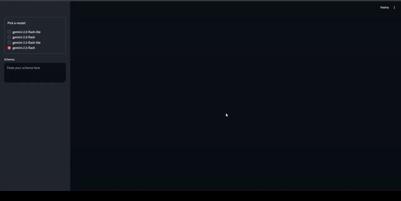

# 🗒️ Schema Visualizer

A Streamlit-powered app that transforms complex JSON Schemas into clear, human-readable summaries and visualizations. Perfect for developers, data analysts, and anyone working with API or data schemas.

## 

## ✨ Features

- **Paste any JSON Schema** and get a concise, structured summary.
- **Model selection**: Choose from multiple Gemini models for analysis.
- **Automatic extraction** of schema titles, field summaries, subfields, and required fields.
- **Interactive visualization**: See fields and subfields with badges for required properties.

---

## 🛠️ How It Works

1. **Paste your JSON Schema** into the app.
2. **Pick a Gemini model** from the sidebar.
3. **Click "Analyze"** to generate a simplified summary.
4. **View results**: Schema title, field summaries, subfields, and required subfields are displayed with visual badges.

---

## 📦 Installation

1. **Clone the repo:**

```bash
git clone https://github.com/TheCarBun/Schema-Visualizer.git
cd Schema-Visualizer
```

2. **Install dependencies:**

```bash
pip install -r requirements.txt
```

3. **Set up environment variables:**

- Create a `.env` file with your Google Gemini API credentials.

4. **Run the app:**

```bash
streamlit run app.py
```

---

## 🧩 Example Output

```json
{
  "schema_title": "User API Schema",
  "fields": [
    {
      "field_name": "user_info",
      "summary": "This object contains essential user details, including unique identifiers and contact information.",
      "subfields": ["user_id", "email"],
      "required_subfields": ["user_id", "email"]
    },
    {
      "field_name": "preferences",
      "summary": "This object holds various user settings, such as theme and notification options.",
      "subfields": ["theme", "notifications"],
      "required_subfields": []
    }
  ]
}
```

---

## 🧑‍💻 Technologies Used

- [Streamlit](https://streamlit.io/) for UI
- [Pydantic](https://docs.pydantic.dev/) for schema validation
- [Google Gemini API](https://ai.google.dev/) for schema analysis
- [dotenv](https://pypi.org/project/python-dotenv/) for environment management

---

## 💡 Contributing

Pull requests and suggestions are welcome!  
Feel free to open issues for bugs or feature requests.

---

## 📄 License

This project is licensed under the Apache 2.0 License.

---

**Happy Streamliting!** 🎉
